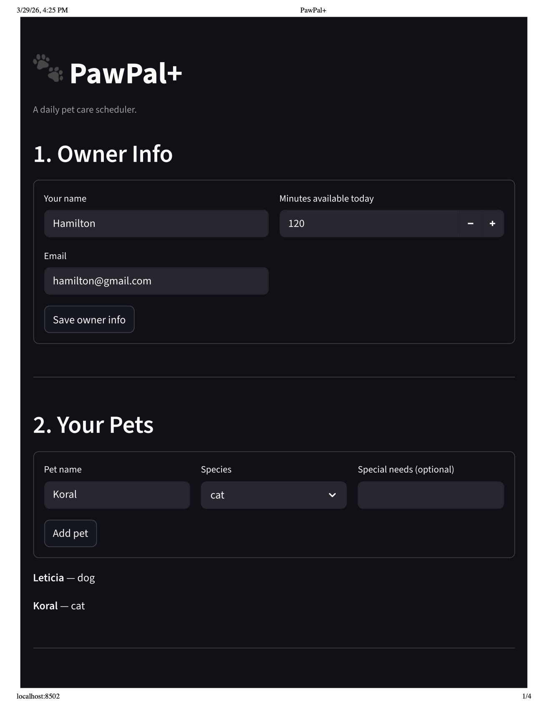
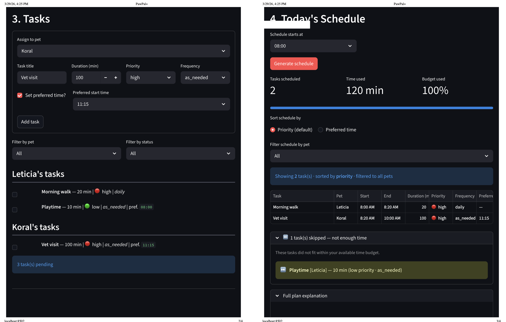

# PawPal+ (Module 2 Project)

You are building **PawPal+**, a Streamlit app that helps a pet owner plan care tasks for their pet.

---

## 📸 Demo

**Owner & Pet setup** — enter owner name, daily time budget, and register pets by species.

<a href="Pal1.png" target="_blank"></a>

**Task management & schedule generation** — add tasks with priority, frequency, and optional preferred start time; the scheduler fills the time budget and flags skipped tasks.

<a href="Pal2.png" target="_blank"></a>

**Full plan explanation** — plain-text summary of every scheduled and skipped task with exact time slots and priorities.

<a href="Pal3.png" target="_blank"></a>

## Scenario

A busy pet owner needs help staying consistent with pet care. They want an assistant that can:

- Track pet care tasks (walks, feeding, meds, enrichment, grooming, etc.)
- Consider constraints (time available, priority, owner preferences)
- Produce a daily plan and explain why it chose that plan

Your job is to design the system first (UML), then implement the logic in Python, then connect it to the Streamlit UI.

## What you will build

Your final app should:

- Let a user enter basic owner + pet info
- Let a user add/edit tasks (duration + priority at minimum)
- Generate a daily schedule/plan based on constraints and priorities
- Display the plan clearly (and ideally explain the reasoning)
- Include tests for the most important scheduling behaviors

## Getting started

### Setup

```bash
python -m venv .venv
source .venv/bin/activate  # Windows: .venv\Scripts\activate
pip install -r requirements.txt
```

### Suggested workflow

1. Read the scenario carefully and identify requirements and edge cases.
2. Draft a UML diagram (classes, attributes, methods, relationships).
3. Convert UML into Python class stubs (no logic yet).
4. Implement scheduling logic in small increments.
5. Add tests to verify key behaviors.
6. Connect your logic to the Streamlit UI in `app.py`.
7. Refine UML so it matches what you actually built.

---

## Features

### Scheduling algorithms

- **Greedy priority scheduling** — Tasks are sorted by priority (`high → medium → low`) and then by duration (shorter first within the same tier) before being assigned. The scheduler greedily accepts each task in order as long as it fits within the owner's daily time budget, maximising the number of tasks completed.

- **Sorting by time** — `Scheduler.sort_by_time()` reorders the task pool chronologically by each task's `preferred_time` (`"HH:MM"` 24-hour). Zero-padded 24-hour strings are lexicographically identical to chronological order, so no integer parsing is needed. Tasks with no `preferred_time` sort to the end via a `"99:99"` sentinel.

- **Contiguous time-slot assignment** — After greedy selection, `build_schedule()` assigns each task a `scheduled_start` (minutes from midnight), beginning at `day_start_minutes` (default 08:00) and advancing by each task's duration. `explain_plan()` renders these as human-readable 12-hour clock ranges (e.g. `8:00 AM – 8:30 AM`).

### Recurrence

- **Daily recurrence** — When `Pet.complete_and_reschedule()` is called on a `"daily"` task, the original is marked complete and a new instance is created with `next_due_date = today + timedelta(days=1)`. The new task is invisible in today's schedule but surfaces automatically the following day.

- **Weekly recurrence** — `"weekly"` tasks follow the same pattern with `next_due_date = today + timedelta(days=7)`. `Task.is_due_today()` additionally gates these tasks by `last_done_date`: a weekly task completed fewer than 7 days ago is withheld from `get_pending_tasks()` entirely.

- **As-needed tasks** — `"as_needed"` tasks are marked complete with no follow-up occurrence created. They reappear in the pending list only when manually added again.

### Conflict warnings

- **Time-overlap detection** — After every `build_schedule()` call, `detect_time_conflicts()` checks every pair of timed tasks (across all pets) for `preferred_time` window overlaps using the standard interval test (`a_start < b_end AND b_start < a_end`). Each warning names both tasks, their pets, and the exact clash window (e.g. `"clash from 8:20 AM to 8:30 AM"`).

- **Priority-inversion detection** — If a higher-priority task was skipped (because it was too long to fit the remaining budget) while at least one lower-priority task was scheduled, the scheduler flags it and suggests either shortening the task or increasing available time.

### Filtering

- **Status and pet filtering** — `Scheduler.filter_tasks(pet_name, completed)` returns a filtered view of the task pool. Both parameters are optional and composable: filter to one pet, to all pending tasks, or to a specific pet's completed tasks.

### Validation

- **Input validation** — `Task.__post_init__()` raises `ValueError` for any invalid `priority` (must be `"high"`, `"medium"`, or `"low"`), invalid `frequency` (must be `"daily"`, `"weekly"`, or `"as_needed"`), or malformed `preferred_time` (must be a valid `"HH:MM"` 24-hour string).

---

## Smarter Scheduling

Beyond the core greedy scheduler, PawPal+ includes several algorithmic improvements that make daily planning more accurate and useful.

### Frequency-aware recurring tasks

Tasks carry a `frequency` field (`"daily"`, `"weekly"`, or `"as_needed"`). The scheduler respects this when loading tasks each day:

- **Daily** and **as_needed** tasks are always eligible.
- **Weekly** tasks are withheld until at least 7 days have passed since they were last completed (tracked via `Task.last_done_date`).

When a recurring task is marked complete, `Pet.complete_and_reschedule()` automatically creates the next occurrence using Python's `timedelta`:

- Daily → `next_due_date = today + timedelta(days=1)`
- Weekly → `next_due_date = today + timedelta(days=7)`

The owner never has to manually re-add recurring tasks.

### Preferred-time sorting

Every task accepts an optional `preferred_time` in `"HH:MM"` 24-hour format (e.g. `"08:00"`, `"17:30"`). Calling `Scheduler.sort_by_time()` returns tasks ordered chronologically using a `sorted()` lambda key that compares the strings directly — zero-padded 24-hour strings sort lexicographically in the same order as chronologically, so no parsing is needed.

### Status and pet filtering

`Scheduler.filter_tasks(pet_name, completed)` lets the owner slice the task pool in any combination:

| Call | Result |
|---|---|
| `filter_tasks(pet_name="Mochi")` | Only Mochi's tasks |
| `filter_tasks(completed=False)` | All pending tasks |
| `filter_tasks(pet_name="Luna", completed=True)` | Luna's completed tasks |

### Conflict detection

The scheduler detects two types of conflicts automatically after every `build_schedule()` call:

**Time conflicts** — If two tasks have `preferred_time` windows that overlap, a warning is generated with the exact clash window (e.g. `"clash from 8:20 AM to 8:30 AM"`). Both same-pet and cross-pet pairs are checked using the standard interval-overlap test: `a_start < b_end AND b_start < a_end`.

**Priority conflicts** — If a higher-priority task was skipped (because it was too long to fit) while a lower-priority task was scheduled, the scheduler flags it and suggests shortening the task or increasing available time.

All warnings surface in `explain_plan()` and in the Streamlit UI without crashing the program.

---

## Testing PawPal+

### Running the tests

```bash
python3 -m pytest tests/test_pawpal.py -v
```

To run a specific group only:

```bash
python3 -m pytest tests/test_pawpal.py::TestSortingCorrectness -v
python3 -m pytest tests/test_pawpal.py::TestRecurrenceLogic -v
python3 -m pytest tests/test_pawpal.py::TestConflictDetection -v
python3 -m pytest tests/test_pawpal.py::TestEdgeCases -v
```

### What the tests cover

The suite contains **26 tests** organized into four groups:

| Group | Tests | What is verified |
|---|---|---|
| **Sorting Correctness** | 4 | `sort_by_time()` returns tasks in chronological `preferred_time` order; tasks without a preferred time sort to the end; `build_schedule()` orders high → medium → low priority; within the same priority tier, shorter tasks are placed first |
| **Recurrence Logic** | 8 | Completing a daily task spawns a next occurrence with `next_due_date = today + 1 day`; weekly tasks get `today + 7 days`; `as_needed` tasks produce no new occurrence; the new instance is invisible in today's pending list but appears on its due date; a weekly task is withheld for 6 days and re-eligible on day 7; completing a non-existent task returns `None` safely |
| **Conflict Detection** | 5 | Overlapping `preferred_time` windows produce a warning; identical start times are always flagged; strictly adjacent windows (end == start of next) do **not** conflict; a skipped high-priority task while lower-priority tasks are scheduled triggers a priority-inversion warning; tasks with no `preferred_time` produce no spurious warnings |
| **Edge Cases** | 7 | Pet with no tasks returns an empty schedule without crashing; zero available minutes skips every task; a task whose duration exactly equals the budget is accepted; a task one minute over budget is skipped; invalid priority, frequency, and `preferred_time` values all raise `ValueError` |

### Confidence Level

**★★★★★ (5 / 5)**

All 26 tests pass. The suite validates the three most failure-prone areas of the system — the priority + duration sort order that drives the greedy algorithm, the `>= 7` day boundary in weekly recurrence logic (where off-by-one errors are silent), and the strict interval-overlap check (`<` not `<=`) that determines when time conflicts are reported. Boundary conditions at the edges of the time budget (exact fit vs. one minute over) are also confirmed. The core scheduling contract is fully covered by the tests; confidence in the system's reliability is high.
