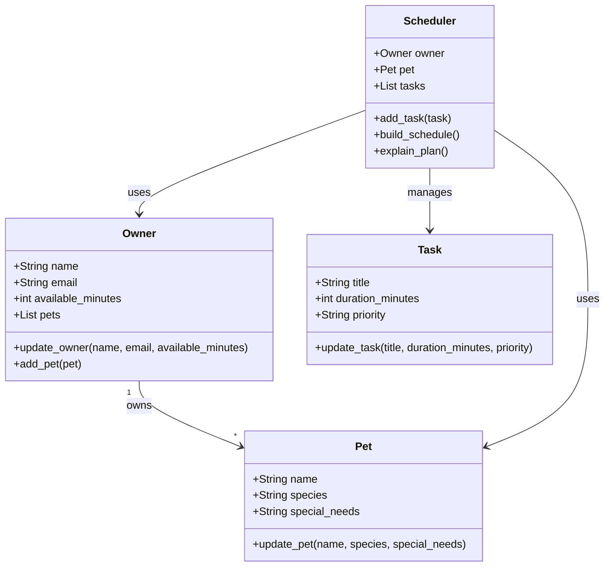
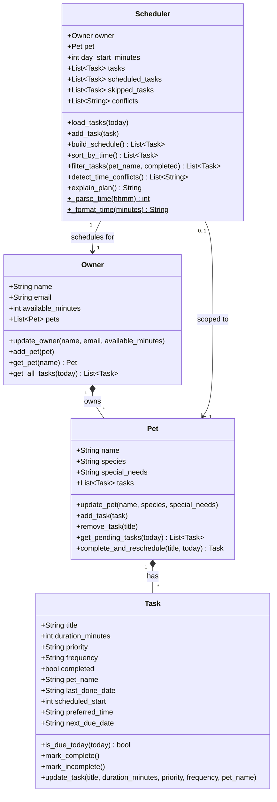

# PawPal+ UML Class Diagrams

## Before — Initial Design

```mermaid
classDiagram
    class Owner {
        +String name
        +String email
        +int available_minutes
        +List pets
        +update_owner(name, email, available_minutes)
        +add_pet(pet)
    }

    class Pet {
        +String name
        +String species
        +String special_needs
        +update_pet(name, species, special_needs)
    }

    class Task {
        +String title
        +int duration_minutes
        +String priority
        +update_task(title, duration_minutes, priority)
    }

    class Scheduler {
        +Owner owner
        +Pet pet
        +List tasks
        +add_task(task)
        +build_schedule()
        +explain_plan()
    }

    Owner "1" --> "*" Pet : owns
    Scheduler --> Owner : uses
    Scheduler --> Pet : uses
    Scheduler --> Task : manages
```

---

## After — Final Implementation

```mermaid
classDiagram
    class Task {
        +String title
        +int duration_minutes
        +String priority
        +String frequency
        +bool completed
        +String pet_name
        +String last_done_date
        +int scheduled_start
        +String preferred_time
        +String next_due_date
        +is_due_today(today) bool
        +mark_complete()
        +mark_incomplete()
        +update_task(title, duration_minutes, priority, frequency, pet_name)
    }

    class Pet {
        +String name
        +String species
        +String special_needs
        +List~Task~ tasks
        +update_pet(name, species, special_needs)
        +add_task(task)
        +remove_task(title)
        +get_pending_tasks(today) List~Task~
        +complete_and_reschedule(title, today) Task
    }

    class Owner {
        +String name
        +String email
        +int available_minutes
        +List~Pet~ pets
        +update_owner(name, email, available_minutes)
        +add_pet(pet)
        +get_pet(name) Pet
        +get_all_tasks(today) List~Task~
    }

    class Scheduler {
        +Owner owner
        +Pet pet
        +int day_start_minutes
        +List~Task~ tasks
        +List~Task~ scheduled_tasks
        +List~Task~ skipped_tasks
        +List~String~ conflicts
        +load_tasks(today)
        +add_task(task)
        +build_schedule() List~Task~
        +sort_by_time() List~Task~
        +filter_tasks(pet_name, completed) List~Task~
        +detect_time_conflicts() List~String~
        +explain_plan() String
        +_parse_time(hhmm)$ int
        +_format_time(minutes)$ String
    }

    Owner "1" *-- "*" Pet : owns
    Pet "1" *-- "*" Task : has
    Scheduler "1" --> "1" Owner : schedules for
    Scheduler "0..1" --> "1" Pet : scoped to
```
